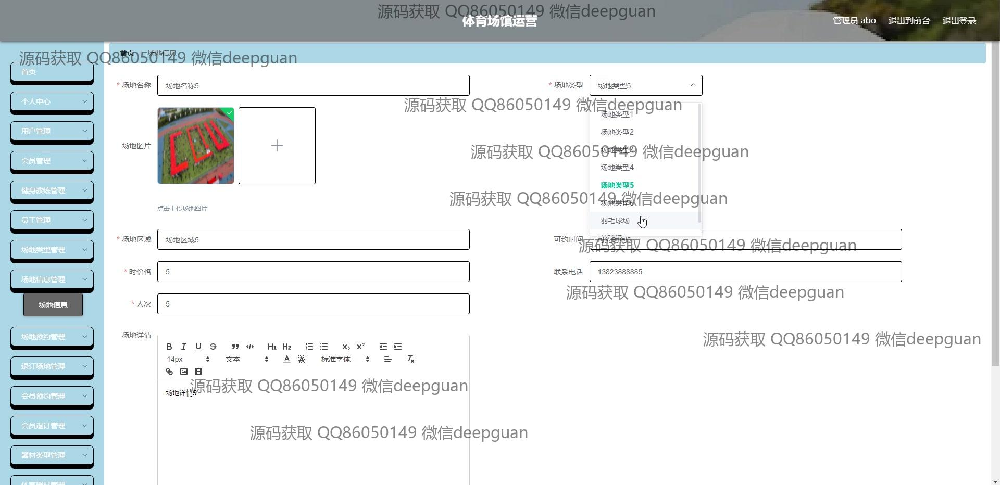
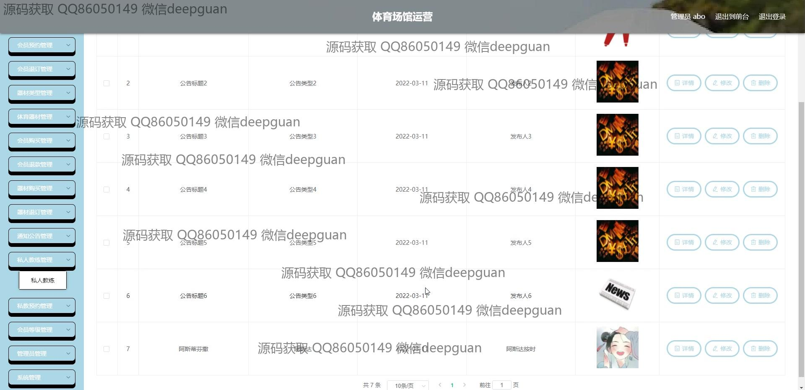

<h1 align="center">体育场馆运营</h1>

## 简介
体育场馆运营系统：基于Spring Boot开发，角色分为管理员、用户；首页、场地信息、体育器材、会员管理、教练管理、在线预订、支付、投诉、通知公告等功能模块，助力高效场馆管理与用户体验提升。    --计算机毕业设计源码；毕设源码；java毕业设计源码

## 联系方式

<h3 align="center">获取完整代码与数据库文件 + 微信：deepguan QQ: 86050149 QQ群: 783742310</h3>

<h3 align="center">可帮忙远程部署 包运行成功！提供远程部署、修改代码、设计文档指导、代码讲解等服务！</h3>

## 功能介绍（完整见运行截图）
管理员：基本功能包括登录、注册和退出。可以通过网站首页的主导航栏访问各个模块，如首页、场地信息、体育器材管理、公告管理等。管理员可以进行场地和教练信息管理，会员等级设置，支付确认和会员管理，通知公告管理，以及用户投诉的查看和处理。管理员具备查看和生成财务统计报表的权限，优化场馆的会员服务及运营效率。

教练：教练模块支持教练信息管理，包括个人信息的录入和修改，上传照片和更新职业履历。可以通过私人教练管理界面查看和预约课程，并管理个人的学员信息。界面友好并支持教练与学员之间的互动，方便课程安排和教学质量的提升。此外，教练也可以访问个人中心查看或修改其私教信息和预约情况。

会员：会员注册功能允许用户填写基本信息注册成为系统成员，可以访问个人中心进行个人信息管理和查看。会员能够浏览场地信息、预约场馆和教练课程，参与活动和赛事。支付功能支持多种付款方式，提供便捷的在线支付体验。会员还可以通过反馈模块提出意见与建议，与管理员就场馆运营进行良好的互动。

普通用户：普通用户可通过注注册界面进行注册后访问系统。可以在网站首页查看场地和器材信息，进行简单的场地预约和购买操作。功能包括在线咨询和用户投诉，通过简单表单与场馆管理人员进行交流。普通用户还能够浏览通知公告查看场馆的最新资讯和活动安排。

## 运行截图

本代码来源于网络,仅供学习参考使用!

